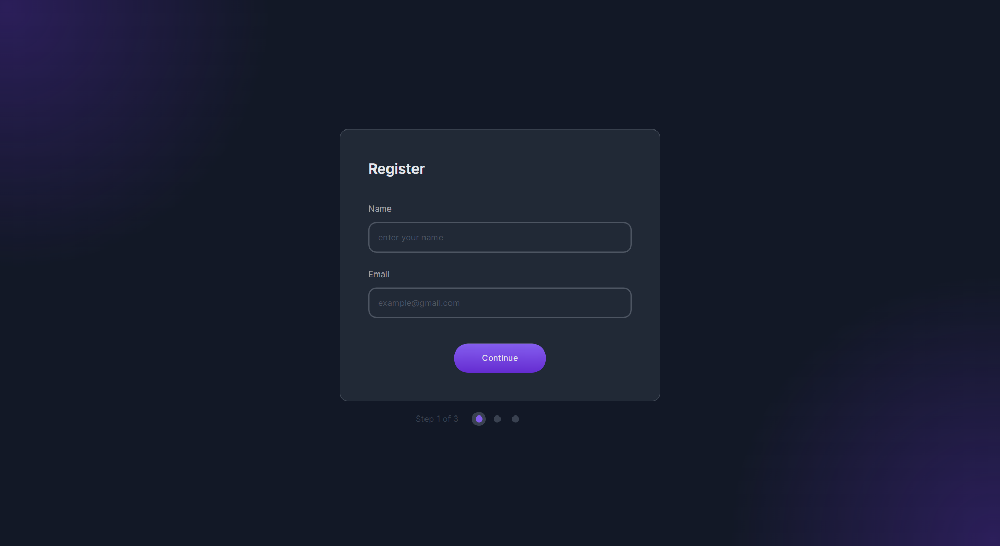
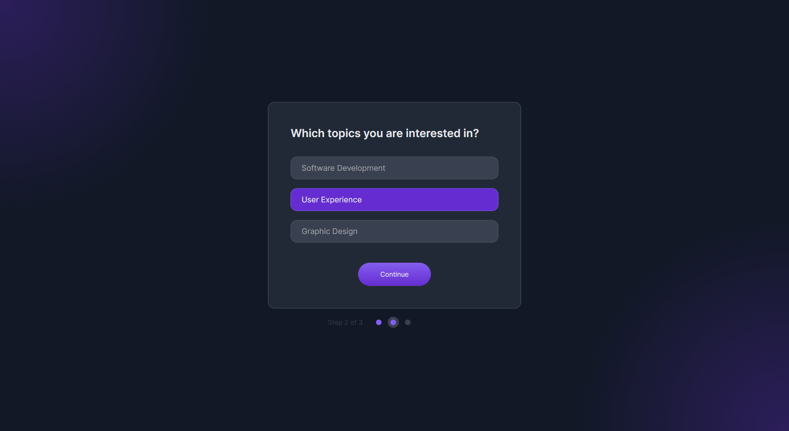
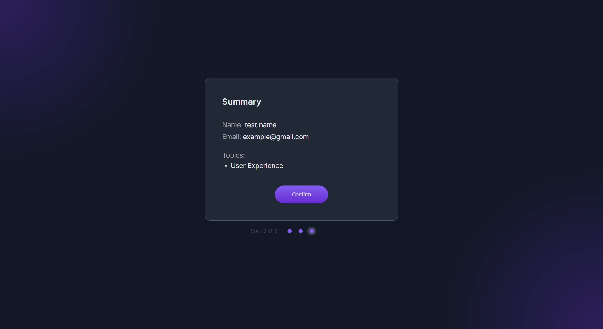
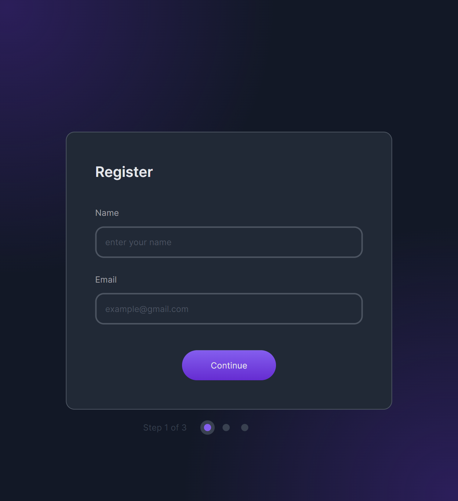
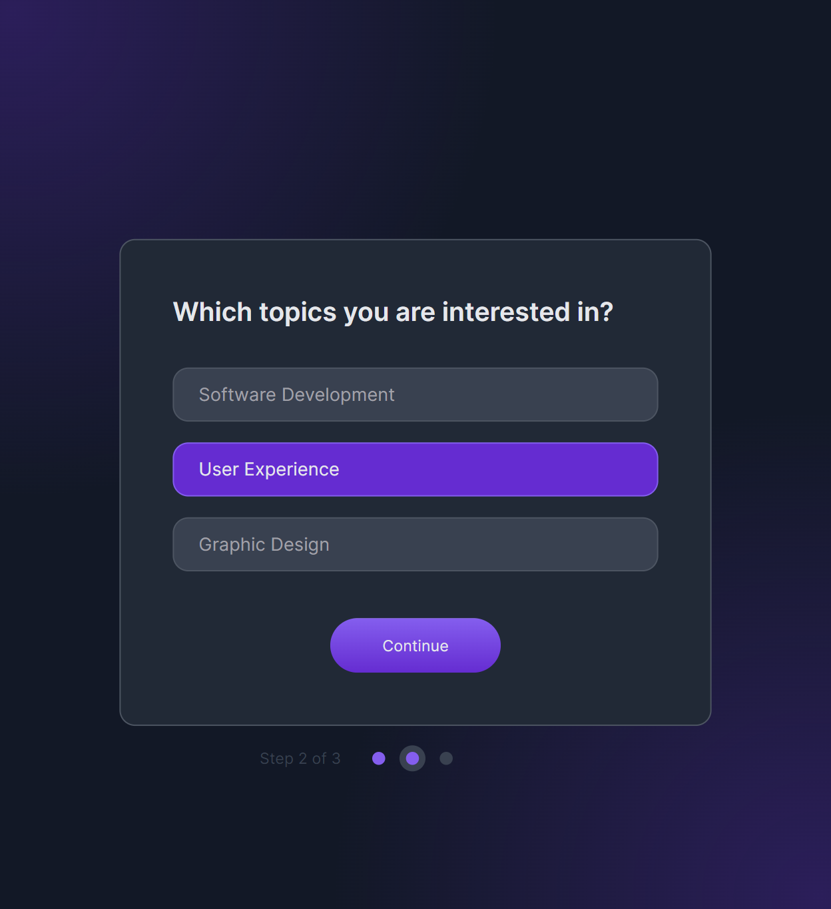
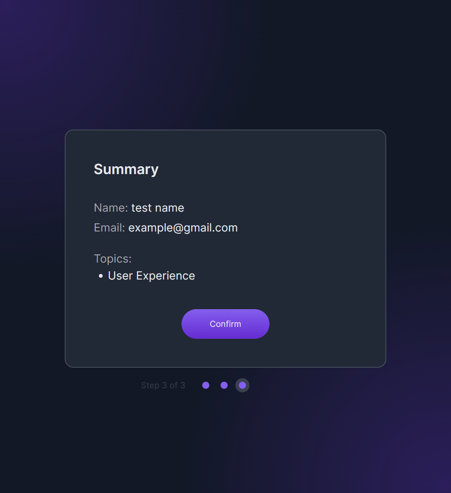

<!-- Please update value in the {}  -->

<h1 align="center">Multi-step Register Form</h1>

<div align="center">
   Solution for a challenge from  <a href="http://devchallenges.io" target="_blank">Devchallenges.io</a>.
</div>

<div align="center">
  <h3>
    <a href="https://h-yoshikawa44.github.io/ch-multi-step-register-form/">
      Demo
    </a>
    <span> | </span>
    <a href="https://devchallenges.io/solution/16493">
      Solution
    </a>
    <span> | </span>
    <a href="https://devchallenges.io/challenge/multi-step-register-form">
      Challenge
    </a>
  </h3>
</div>

<!-- TABLE OF CONTENTS -->

## Table of Contents

- [Table of Contents](#table-of-contents)
- [Overview](#overview)
  - [Desktop](#desktop)
  - [Mobile](#mobile)
  - [Built With](#built-with)
- [Features](#features)
- [How To Use](#how-to-use)
- [learned/improved](#learnedimproved)
- [Acknowledgements](#acknowledgements)
- [Contact](#contact)

<!-- OVERVIEW -->

## Overview

### Desktop

<details>
  <summary>Desktop</summary>
  
  
  
</details>

### Mobile

<details>
  <summary>Mobile</summary>
  
  
  
</details>

### Built With

<!-- This section should list any major frameworks that you built your project using. Here are a few examples.-->

Base

- [HTML](https://developer.mozilla.org/ja/docs/Web/HTML)
- [CSS](https://developer.mozilla.org/ja/docs/Web/CSS)
- [JavaScript](https://developer.mozilla.org/ja/docs/Web/JavaScript)
- [Node.js](https://nodejs.org/)：20.11.1
- [Vite](https://ja.vitejs.dev/)：5.2.0

Other major libraries

- [Lightning CSS](https://lightningcss.dev/)

## Features

<!-- List the features of your application or follow the template. Don't share the figma file here :) -->

This application/site was created as a submission to a [DevChallenges](https://devchallenges.io/challenges) challenge. The [challenge](https://devchallenges.io/challenge/multi-step-register-form) was to build an application to complete the given user stories.

- [x] Create a multi-step registration page that matches the given design.
- [x] Use HTML to create the basic structure.
- [x] Add form, inputs, buttons, stepper,... according to the design.
- [x] Add validations to the inputs: name and email input should be required and email input should only accept email format.
- [x] Use Vanilla JavaScript to add interactivity.
- [x] Users should not be able to continue to the next step if inputs are empty or the topic is not selected.
- [x] Users can continue to the next step if inputs are filled or topic is selected.
- [x] Users should know which step they are at.
- [x] When users click confirm, they should see an alert with '✅ Success' message.
- [x] The page should be responsive on different screen sizes.
- [x] Deploy the solution and submit Repository URL and Demo URL.

## How To Use

<!-- Example: -->

To clone and run this application, you'll need [Git](https://git-scm.com) and [Node.js](https://nodejs.org/en/download/) (which comes with [npm](https://www.npmjs.com/)) installed on your computer. From your command line:

```bash
# Clone this repository
git clone https://github.com/h-yoshikawa44/ch-multi-step-register-form.git
# or
git clone git@github.com:h-yoshikawa44/ch-multi-step-register-form.git

# Install dependencies
npm install

# Run the Vite
npm run dev
```

## learned/improved

- How to specify multiple backgroud-images.
- The background color for autocomplete specified in the UA style cannot be overridden.
- How to get only checked checkbox elements with a check.

## Acknowledgements

<!-- This section should list any articles or add-ons/plugins that helps you to complete the project. This is optional but it will help you in the future. For exmpale -->

- [MDN - Document: querySelector()](https://developer.mozilla.org/ja/docs/Web/API/Document/querySelector)
- [MDN - Document.createElement()](https://developer.mozilla.org/ja/docs/Web/API/Document/createElement)
- [MDN - :autofill](https://developer.mozilla.org/ja/docs/Web/CSS/:autofill)
- [背景画像が自由自在！CSS3を活用しよう](https://big-mac.jp/column/free-background-image-use-css3/)
- [JavaScriptでinput value取得が簡単！7つの実践サンプルコードで解説](https://jp-seemore.com/web/5201/)
- [選択状態のチェックボックスだけを取得する](https://gray-code.com/javascript/get-only-selected-checkboxes)

## Contact

- Website：[h-yoshikawa44.com](https://h-yoshikawa44.com)
- GitHub：[@h-yoshikawa44](https://github.com/h-yoshikawa44)
- Twitter：[@yoshi44_lion](https://twitter.com/yoshi44_lion)
